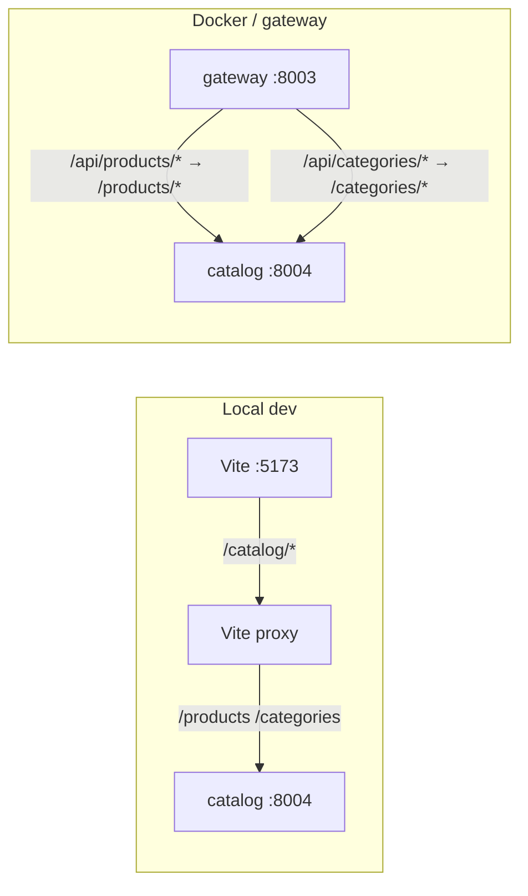

# Integrate catalog routes (catalog-service + frontend)

## Current state

- **Catalog service** ([`services/catalog-service/app/main.py`](services/catalog-service/app/main.py)): mounts [`products`](services/catalog-service/app/routers/products.py) at `/products` and [`categories`](services/catalog-service/app/routers/categories.py) at `/categories`. List/detail use standard query params (`search`, `category_id`, `skip`, `limit`, etc.). JSON responses match [`ProductResponse`](services/catalog-service/app/schemas/product.py) / [`CategoryResponse`](services/catalog-service/app/schemas/category.py) (numeric `id`, `price` as decimal string in JSON, nested `category`, `is_active`, no `tagline` / `image` / `material`).
- **Frontend** ([`frontend/src/lib/products.ts`](frontend/src/lib/products.ts), [`frontend/src/routes/index.tsx`](frontend/src/routes/index.tsx), [`frontend/src/routes/product.$id.tsx`](frontend/src/routes/product.$id.tsx)): uses in-memory `PRODUCTS` / `CATEGORIES`, string slugs for `id` and `cat`, and fields the API does not provide.
- **Browser access**: catalog-service has **no CORS** middleware, so the UI must call it through **same-origin** (Vite `server.proxy`), **or** through the **gateway** (which already has [`CORSMiddleware`](services/gateway-service/app/main.py) for browser clients).

### Gateway status (as of this plan)

| Piece                                                           | Status                                                                                                                                                                                                                                                                                                      |
| --------------------------------------------------------------- | ----------------------------------------------------------------------------------------------------------------------------------------------------------------------------------------------------------------------------------------------------------------------------------------------------------- |
| [`SERVICE_ROUTES`](services/gateway-service/app/core/config.py) | `catalog` is only `/api/products` → `catalog_service_url`. **No** `/api/categories` entry. **No** `upstream_prefix` in config (strip behavior alone is insufficient).                                                                                                                                       |
| [`proxy.py`](services/gateway-service/app/routers/proxy.py)     | With `strip_prefix: True`, builds `target_path` as `/{path}` or `/` only. So `/api/products/1` becomes upstream **`/1`**, not **`/products/1`**. **Rewrite/join logic is still required.**                                                                                                                  |
| [`auth.py`](services/gateway-service/app/middleware/auth.py)    | `GET` under `/api/products` is public via `startswith`. **`/api/categories/...`** is **not** covered by that rule; only an exact `PUBLIC_ROUTES` entry would match `/api/categories` exactly, so nested paths like `/api/categories/root` would incorrectly require JWT until a `GET` prefix rule is added. |

**Intended pattern:** declare per-route `upstream_prefix` (e.g. `/products`, `/categories`) in config, and have the proxy **concatenate** `upstream_prefix` + stripped suffix (normalize slashes). Register a second gateway service key for categories (same `catalog_service_url`, different `prefix` / `upstream_prefix`). Mirror products auth: allow `GET` for `path.startswith("/api/categories")` if category browsing is public.

## Recommended approach

### 1. Catalog HTTP client + Zod (frontend)

- Add a small module (e.g. [`frontend/src/lib/catalogApi.ts`](frontend/src/lib/catalogApi.ts)) that:
    - Reads base URL from **`import.meta.env.VITE_CATALOG_BASE_URL`** (e.g. same-origin `/catalog` in dev when proxied to catalog; or `http://localhost:8003/api` if all traffic goes through the gateway—see §5). No silent code defaults unless you document them at the end of the task per your env rules.
    - Exposes `fetchProducts(params)`, `fetchProduct(id)`, `fetchCategories()` (and optionally `fetchRootCategories()` using [`GET /categories/root`](services/catalog-service/app/routers/categories.py)) using `fetch`.
    - Parses JSON with **Zod** schemas mirroring API fields (`price` as `z.union([z.string(), z.number()]).transform(...)` for decimals).

### 2. Map API → existing UI `Product` type

- Keep [`frontend/src/store/cart.tsx`](frontend/src/store/cart.tsx) and cart/checkout/order flows stable by **retaining** the current [`Product`](frontend/src/lib/products.ts) shape where practical:
    - `id`: `String(api.id)` so routes stay `/product/$id` with string params.
    - `price`: number (parsed from API).
    - `inStock`: `api.is_active` (or always `true` for `active_only` listings if you prefer).
    - `category`: use **slug derived from category name** (e.g. lowercase, spaces to hyphens) so filters and “related” logic keep working; store `categoryId` on the object only if you need it for refetch (optional extension).
    - `tagline` / `material` / `image`: **sensible fallbacks** from API data (e.g. tagline = first line or truncated `description`; image = deterministic placeholder or a small curated map by category slug until the API gains an `image_url` field).

- Move **`formatPrice`** (and any purely presentational helpers) to a tiny shared module if needed to avoid circular imports between `products.ts` and the mapper.

### 3. TanStack Router: data loading

- **Home** [`frontend/src/routes/index.tsx`](frontend/src/routes/index.tsx):
    - Add a **`loader`** (or `beforeLoad`) that loads categories + products (for `cat === "all"` use `GET /products/` with `search` when `q` is set; when a category is selected, use `category_id` query on [`GET /products/`](services/catalog-service/app/routers/products.py) or filter client-side after one fetch—prefer server filter for consistency with pagination later).
    - Change search schema: `cat` as **`"all" | string`** where non-`all` values are **category ids** (or slugs that you resolve to ids in the loader from loaded categories). Update `Link` `search` objects accordingly.
    - Show **loading / error** UI (existing [`ProductCardSkeleton`](frontend/src/components/ProductCard.tsx) helps).

- **Product detail** [`frontend/src/routes/product.$id.tsx`](frontend/src/routes/product.$id.tsx):
    - Replace `getProduct` from static data with **`loader` async** `GET /products/{id}`; `notFound()` on 404; keep meta/OG tags using mapped fields.

- **Related products** on the product page: `GET /products/?category_id=...` excluding current id, or reuse list from parent route cache if you introduce a query client later (simplest v1: one extra fetch in loader).

### 4. Vite proxy (dev same-origin to catalog)

- Extend [`frontend/vite.config.ts`](frontend/vite.config.ts) per the package comment pattern: `defineConfig({ vite: { server: { proxy: { ... } } } })`.
    - Example: proxy prefix **`/catalog`** → `http://127.0.0.1:8004` with `rewrite` stripping `/catalog` so `/catalog/products` hits catalog `/products`.

- Add **`frontend/.env.example`** documenting `VITE_CATALOG_BASE_URL=/catalog` for local dev (direct to catalog via proxy). If using gateway instead, document e.g. `http://localhost:8003/api` and paths `/products`, `/categories` **after** gateway rewrite is correct.

### 5. Gateway (for Docker / nginx / single browser-facing API host)

Do **both** of the following; config alone is not enough until `proxy.py` applies it.

1. **`proxy.py`**: When `strip_prefix` is true, compute `target_path` as:
    - `upstream_prefix.rstrip("/") + "/" + path` when `path` is non-empty, else `upstream_prefix` or `upstream_prefix + "/"` so list endpoints resolve (match how FastAPI expects `/products/` vs `/products`).
    - Services without `upstream_prefix` keep today’s behavior **only if** their upstream already expects paths at `/` (verify cart/order/inventory URLs match each service).

2. **`config.py`**: Add `upstream_prefix: "/products"` on `catalog`; add a `catalog_categories` (or similar) entry with `prefix: "/api/categories"`, same `catalog_service_url`, `upstream_prefix: "/categories"`, `strip_prefix: True`.

3. **`auth.py`**: Add `method == "GET" and path.startswith("/api/categories")` (or tighten to read-only paths only). Keep mutating verbs on categories protected unless you intentionally expose admin APIs through the gateway.

### 6. Data / ops note

- Repo has DB init for multiple databases but **no catalog seed SQL** under `infra/postgres/init/`; until you seed or migrate sample rows, the UI will show empty states. Mention in `.env.example` or a one-liner in PR: run catalog migrations and insert minimal categories/products (or add a seed script later).

## Files likely touched

| Area          | Files                                                                                                                                                                                                                                                                                                |
| ------------- | ---------------------------------------------------------------------------------------------------------------------------------------------------------------------------------------------------------------------------------------------------------------------------------------------------- |
| API + mapping | New `frontend/src/lib/catalogApi.ts`; slim [`frontend/src/lib/products.ts`](frontend/src/lib/products.ts) (types + `formatPrice` + mapper; remove or keep mock behind a flag only if you want a demo fallback—default off when `VITE_CATALOG_BASE_URL` is set)                                       |
| Routes        | [`frontend/src/routes/index.tsx`](frontend/src/routes/index.tsx), [`frontend/src/routes/product.$id.tsx`](frontend/src/routes/product.$id.tsx)                                                                                                                                                       |
| Dev proxy     | [`frontend/vite.config.ts`](frontend/vite.config.ts)                                                                                                                                                                                                                                                 |
| Env docs      | New `frontend/.env.example`                                                                                                                                                                                                                                                                          |
| Gateway       | [`services/gateway-service/app/core/config.py`](services/gateway-service/app/core/config.py), [`services/gateway-service/app/routers/proxy.py`](services/gateway-service/app/routers/proxy.py), [`services/gateway-service/app/middleware/auth.py`](services/gateway-service/app/middleware/auth.py) |

## Testing

- Manual: run catalog on **8004**, set env, `npm run dev`, verify list, filters, detail, add-to-cart.
- Gateway: `curl` via **8003** for `/api/products/`, `/api/products/1`, `/api/categories/root` and confirm catalog receives `/products/...` and `/categories/...`.
- Optional: ask if you want **Vitest** tests for the Zod mapper and URL building (repo may not have Vitest yet—only add if you confirm).

## Env (for your end-of-task checklist)

After implementation, you will need:

- **Create** [`frontend/.env.example`](frontend/.env.example) (and local `frontend/.env` ignored by git if not present) with:
    - `VITE_CATALOG_BASE_URL` — e.g. `/catalog` (dev + Vite proxy to catalog) or `http://localhost:8003/api` when using the gateway (with paths aligned to gateway prefixes).
- **No new catalog-service env vars** for read-only integration; gateway continues to use existing service URLs.

If any default is chosen in code (e.g. `/catalog` only when env missing), call it out explicitly per your rule.
